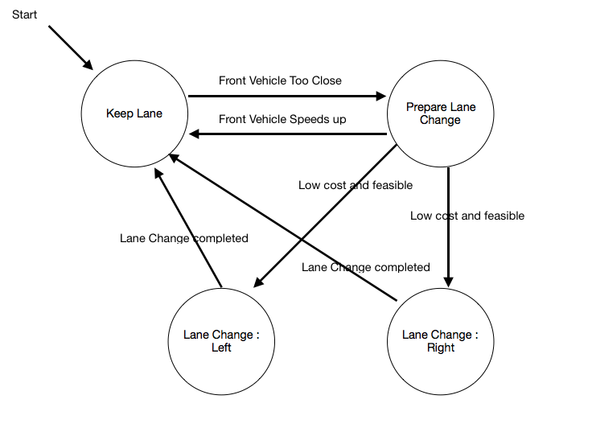

# CarND-Path-Planning-Project
Self-Driving Car Engineer Nanodegree Program
   
### Introduction
This project is the Udacity "Self Driving Car" nanodegree program's term 3, project 1. As part of this project, main requirement is to autonomously drive the car around the track of 4.32 miles without any incident.

Here incident refers to following categories:
   Keeping the given speed limit of 50mph
   
   No collision with other cars
   
   Keeping the lane
   
   When there is a vehicle in front, which is driving below speed limit, then try to safely change lane
   
   At any time, total acceleration of 10 m/s^2 and a jerk of 10 m/s^3 should not be exceeded, which makes it uncomfortable for passenger

### Rubric Points

Please find the video from above link, the view the output of path planner.

The path planner satisfies all the requirements, and car drives indefinitely on track in any traffic situations.

## Model Documentation

This project can have 'n' number of different way to deal with the required problems. I have followed the approach to create a small Finite State Machine model, which takes care of taking different decisions based on the current state and also takes care of avoiding all incidents.

Here is the data provided from the Simulator to the C++ Program

#### Main car's localization Data (No Noise)

["x"] The car's x position in map coordinates

["y"] The car's y position in map coordinates

["s"] The car's s position in frenet coordinates

["d"] The car's d position in frenet coordinates

["yaw"] The car's yaw angle in the map

["speed"] The car's speed in MPH

#### Previous path data given to the Planner

//Note: Return the previous list but with processed points removed, can be a nice tool to show how far along
the path has processed since last time. 

["previous_path_x"] The previous list of x points previously given to the simulator

["previous_path_y"] The previous list of y points previously given to the simulator

#### Previous path's end s and d values 

["end_path_s"] The previous list's last point's frenet s value

["end_path_d"] The previous list's last point's frenet d value

#### Sensor Fusion Data, a list of all other car's attributes on the same side of the road. (No Noise)

["sensor_fusion"] A 2d vector of cars and then that car's [car's unique ID, car's x position in map coordinates, car's y position in map coordinates, car's x velocity in m/s, car's y velocity in m/s, car's s position in frenet coordinates, car's d position in frenet coordinates. 

### Path generation steps
   Our main goal is to create a path which is free from jerks and acceleration limits. For that the most important point to remember is, the    path should be continuous, means we should try to utilize the previous path points which were provided to simulator.
   
   To ease the calculations we convert the global coordinates to car coordinates, and at the end revert from car to global coordinates.
   
   We choose the different way points, which are atleast 30m apart and then pass those points to spline to fit into a smooth curve.
   
   By using the spline we try to fit approx 50 path points for simulator to follow by providing the spaced points x points and getting corresponding y points.
   
   Once we have this vector of points available then we convert them to global coordinates and pass to simulator.
   

---

